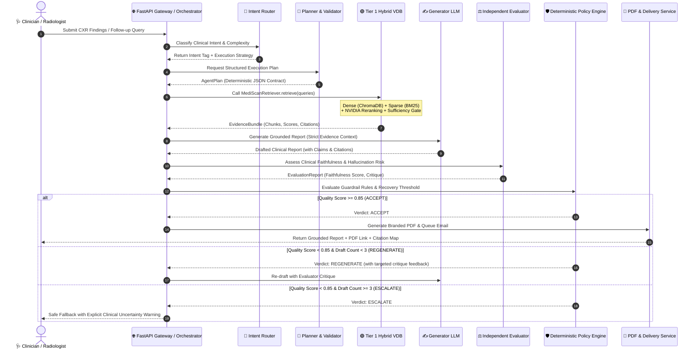
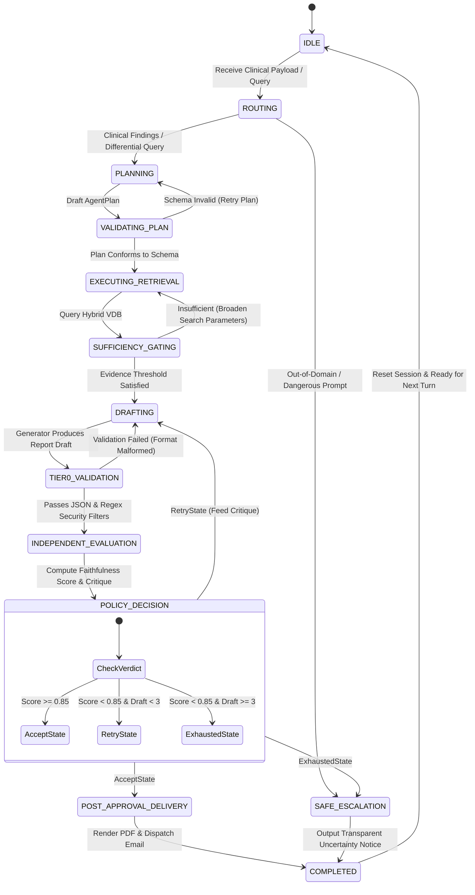
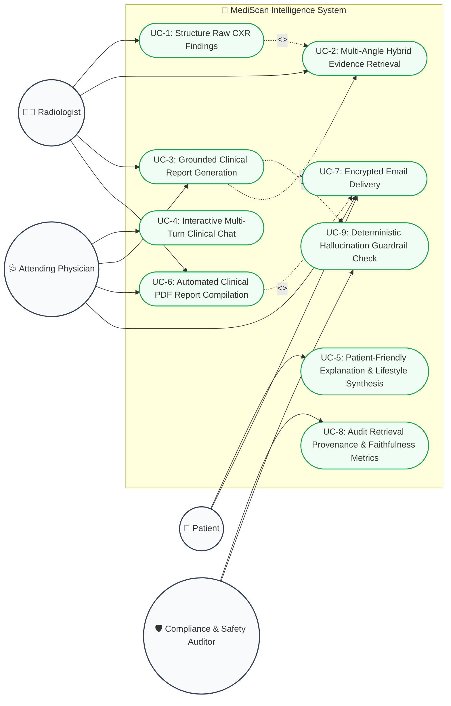
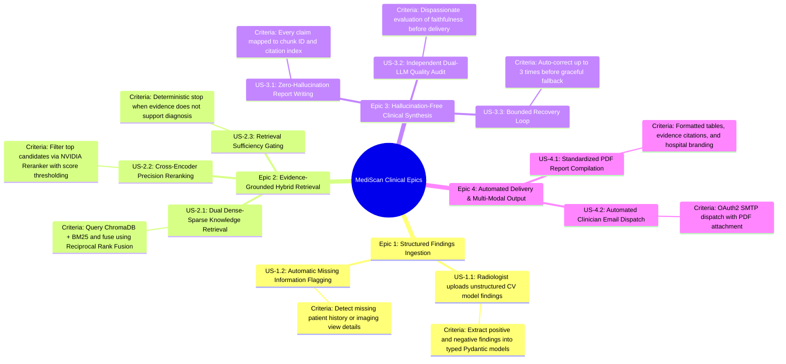
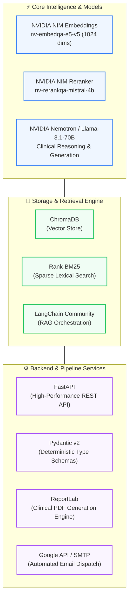

# 🫁 MediScan: Evidence-Grounded Agentic AI for Clinical Intelligence

> **An Enterprise-Grade, 13-Stage Agentic RAG Platform with Deterministic Guardrails for Medical Intelligence, Radiology Analysis, and Automated Clinical Delivery.**

---

<div align="center">
  
</div>

---

## 📑 Visual Architecture & Flow Index

1. [High-Level System Architecture](#1-high-level-system-architecture)
2. [Architectural Flow (Tier 1 & Tier 2)](#2-architectural-flow)
3. [Clinical Work Flow (End-to-End Execution Lifecycle)](#3-clinical-work-flow)
4. [Operations Flow & State Machine (Bounded Recovery Loop)](#4-operations-flow--recovery-state-machine)
5. [Use Case Diagrams](#5-system-use-case-diagrams)
6. [User Story Mapping & Requirements Flow](#6-user-story-mapping--requirements-flow)
7. [Technology Stack](#7-technology-stack)

---

## 1. High-Level System Architecture

```mermaid
graph TB
    subgraph KNOWLEDGE_SOURCES ["📚 Multi-Source Clinical Knowledge Base"]
        direction LR
        S1["Cleaned Medical Docs"] ~~~ S2["OpenI CXR Reports (XML)"] ~~~ S3["Clinical Guidelines"] ~~~ S4["Web Medical Sources"] ~~~ S5["Patient Education"]
    end

    subgraph TIER1 ["🟢 TIER 1: Frozen VDB & Deterministic Hybrid RAG Engine"]
        direction TB
        ACQ["Acquisition & Ingestion"] --> CLEAN["Medical Cleaner & De-Identification"]
        CLEAN --> PARSE["Clinical Section Parser<br/>(Findings, Impression, History)"]
        PARSE --> CHUNK["Section-Aware Overlap Chunker"]
        CHUNK --> EMB["NVIDIA NIM Embeddings<br/>(nv-embedqa-e5-v5 / 1024 dims)"]
        EMB --> DUAL_IDX["Dual Index Construction"]
        DUAL_IDX --> DENSE_DB[("ChromaDB Vector Store")]
        DUAL_IDX --> SPARSE_DB[("BM25 Keyword Index")]
        
        DENSE_DB & SPARSE_DB --> RETRIEVE["Dual Retrieval (Top-N)"]
        RETRIEVE --> RRF["Hybrid Fusion (RRF Algorithm)"]
        RRF --> RERANK["NVIDIA NIM Reranker<br/>(nv-rerankqa-mistral-4b Cross-Encoder)"]
        RERANK --> SELECTOR["Evidence Selector & Deduplication"]
        SELECTOR --> SUFF_GATE["Sufficiency Gate (Score & Diversity Check)"]
        SUFF_GATE --> RETRIEVER_API[["MediScanRetriever.retrieve() Stable API"]]
    end

    subgraph TIER2 ["🟣 TIER 2: 13-Stage Agentic Pipeline with Deterministic Guardrails"]
        direction TB
        U_IN["👤 User Input<br/>(Natural Language / CXR Report)"] --> ST1["1. Router (Intent & Complexity)"]
        ST1 --> ST2["2. Planner LLM (AgentPlan Draft)"]
        ST2 --> ST3["3. Plan Validator (Deterministic Python)"]
        ST3 --> ST4["4. Deterministic Executor (Python Controlled)"]
        ST4 --> ST5["5. Call MediScan RAG API (Tier 1 Black Box)"]
        ST5 --> ST6["6. Evidence Selection (Top-K Chunks + Provenance)"]
        ST6 --> ST7["7. Sufficiency Gate (Threshold & Coverage Check)"]
        ST7 --> ST8["8. Clinical Generator LLM (Evidence-Grounded Draft)"]
        ST8 --> ST9["9. Tier-0 Validation (JSON, Schema, Safety Filters)"]
        ST9 --> ST10["10. Independent Evaluator LLM (Faithfulness Scoring)"]
        ST10 --> ST11["11. Deterministic Policy Engine (Accept / Loop / Fallback)"]
        
        ST11 -->|REGENERATE / RE-RETRIEVE| LOOP{"Bounded Recovery Loop<br/>(Max 3 Drafts)"}
        LOOP -.->|Draft Retry| ST8
        LOOP -.->|Broaden Query| ST5
        
        ST11 -->|ACCEPT| ST13["13. Post-Approval Delivery"]
        LOOP -->|ESCALATE (Exhausted)| ESCALATE["Safe Uncertainty Fallback"]
        ESCALATE --> ST13
    end

    subgraph OUTPUTS ["🚀 Verified Multi-Modal Outputs"]
        direction LR
        ST13 --> O1["🩺 Evidence-Grounded Answer"]
        ST13 --> O2["📎 Verifiable Citations (Chunk IDs & Sources)"]
        ST13 --> O3["📄 Branded PDF Clinical Report"]
        ST13 --> O4["✉️ Secure Automated Email Delivery"]
    end

    KNOWLEDGE_SOURCES ==> TIER1
    TIER1 ==> ST5

    classDef tier1Style fill:#ecfdf5,stroke:#059669,stroke-width:2px,color:#065f46;
    classDef tier2Style fill:#f5f3ff,stroke:#7c3aed,stroke-width:2px,color:#5b21b6;
    classDef outStyle fill:#eff6ff,stroke:#2563eb,stroke-width:2px,color:#1e40af;
    class TIER1 tier1Style;
    class TIER2 tier2Style;
    class OUTPUTS outStyle;
```

---

## 2. Architectural Flow

```mermaid
flowchart TD
    %% INGESTION FLOW
    subgraph INGESTION ["📥 Ingestion & Dual Indexing Pipeline (Tier 1)"]
        D1["Raw Clinical Data Sources<br/>(XML / PDF / Articles)"] --> D2["Normalization & De-identification"]
        D2 --> D3["Clinical Section Extractor"]
        D3 --> D4["Section-Aware Chunking (Overlap = 15%)"]
        D4 --> D5["NVIDIA Embedding Engine (1024-dim)"]
        D5 --> D6A["Dense Indexing (ChromaDB)"]
        D4 --> D6B["Sparse Tokenizer Indexing (BM25)"]
    end

    %% HYBRID RETRIEVAL FLOW
    subgraph HYBRID_RETRIEVAL ["🔍 Hybrid Retrieval & Reranking Subsystem"]
        Q["Extracted Clinical Retrieval Query"] --> QA["Dense Semantic Search (Cosine)"]
        Q --> QB["Sparse Keyword Search (BM25)"]
        QA -->|Top 25 Dense| FUSION["Reciprocal Rank Fusion (RRF)"]
        QB -->|Top 25 Sparse| FUSION
        FUSION -->|Top 15 Fused Chunks| RERANKER["NVIDIA Cross-Encoder Reranker"]
        RERANKER -->|Top 5 High-Scoring Chunks| DEDUP["Deduplication & Diversity Gate"]
        DEDUP --> EV_OUT["Verified Evidence Bundle + Scores"]
    end

    %% ORCHESTRATION FLOW
    subgraph AGENT_CONTROL ["🛡️ Agentic Reasoning & Guardrail Flow (Tier 2)"]
        USER_QUERY["Clinician Input"] --> ROUTER{"Intent Router"}
        ROUTER -->|Medical / CXR Finding| PLANNER["LLM Plan Generation"]
        ROUTER -->|Conversational / Out-of-Domain| DIRECT_ROUTE["Deterministic Guardrail Handler"]
        
        PLANNER --> PLAN_VAL["Deterministic Python Plan Validator"]
        PLAN_VAL -->|Valid Plan| EXEC["Deterministic Step Executor"]
        PLAN_VAL -->|Invalid Schema| PLAN_FIX["Plan Auto-Correction"]
        PLAN_FIX --> EXEC
        
        EXEC --> HYBRID_RETRIEVAL
        EV_OUT --> SUFF_CHECK{"Retrieval Sufficiency Threshold met?"}
        SUFF_CHECK -->|Yes| GEN_DRAFT["Evidence-Grounded Report Generator"]
        SUFF_CHECK -->|No| QUERY_RETRY["Query Expansion / Soft Fallback"]
        
        GEN_DRAFT --> TIER0_VAL["Tier-0 Syntax & Guardrail Verification"]
        TIER0_VAL --> EVALUATOR["Independent LLM Evaluator (Critique)"]
        EVALUATOR --> POLICY{"Deterministic Policy Engine"}
        
        POLICY -->|Passed (Score >= 0.85)| ACCEPTED["Approved Clinical Response"]
        POLICY -->|Failed & Retries < 3| REGEN["Controlled Regeneration"]
        POLICY -->|Failed & Retries >= 3| SAFE_FAIL["Safe Clinical Escalation Notice"]
        
        REGEN --> GEN_DRAFT
    end

    D6A & D6B -.-> QA & QB
    ACCEPTED & SAFE_FAIL --> DISPATCH["PDF Rendering Engine & SMTP Service"]

    classDef stageBox fill:#ffffff,stroke:#3b82f6,stroke-width:1.5px;
    class D1,D2,D3,D4,D5,D6A,D6B,QA,QB,FUSION,RERANKER,DEDUP,ROUTER,PLANNER,PLAN_VAL,EXEC,GEN_DRAFT,TIER0_VAL,EVALUATOR,POLICY stageBox;
```

---

## 3. Clinical Work Flow



---

## 4. Operations Flow & Recovery State Machine



---

## 5. System Use Case Diagrams



---

## 6. User Story Mapping & Requirements Flow



---

## 7. Technology Stack



---

<div align="center">
  <sub>Built for precision, safety, and evidence-grounded clinical decision support.</sub>
</div>
