# 🫁 MediScan: Evidence-Grounded Agentic AI for Clinical Intelligence

> **An Enterprise-Grade, 13-Stage Agentic RAG Platform with Deterministic Guardrails for Medical Intelligence, Radiology Analysis, and Automated Clinical Delivery.**

---

  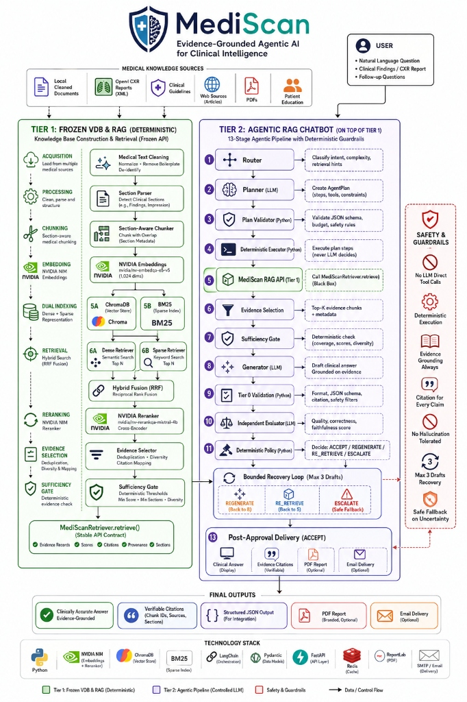

---

## 📑 Complete System Blueprint & Index

1. [High-Level System Architecture](#1-high-level-system-architecture)
2. [Tier 1 Reference: Frozen VDB & Deterministic Hybrid RAG](#2-tier-1-reference-frozen-vdb--deterministic-hybrid-rag)
3. [Tier 2 Reference: 13-Stage Agentic RAG Pipeline](#3-tier-2-reference-13-stage-agentic-rag-pipeline)
4. [Mathematical & Algorithmic Foundations](#4-mathematical--algorithmic-foundations)
5. [Architectural Flow (End-to-End Data & Hybrid Ingestion)](#5-architectural-flow)
6. [Clinical Work Flow (Execution Sequence Diagram)](#6-clinical-work-flow)
7. [Operations Flow & Runtime State Machine (Bounded Recovery Loop)](#7-operations-flow--runtime-state-machine)
8. [System Use Case Diagrams](#8-system-use-case-diagrams)
9. [User Story Mapping & Requirements Hierarchy](#9-user-story-mapping--requirements-hierarchy)
10. [Core Safety & Clinical Guardrail Principles](#10-core-safety--clinical-guardrail-principles)
11. [Data Sources & Storage Layout](#11-data-sources--storage-layout)
12. [Technology Stack](#12-technology-stack)

---

## 1. High-Level System Architecture

MediScan is engineered as a **two-tier decoupled architecture**:
- **Tier 1 (Deterministic Knowledge Base & RAG Engine)**: Fully deterministic, frozen, reproducible, zero LLM side-effects.
- **Tier 2 (Agentic Clinical Orchestrator)**: 13-stage multi-model pipeline operating strictly on top of Tier 1 via deterministic Python guardrails.

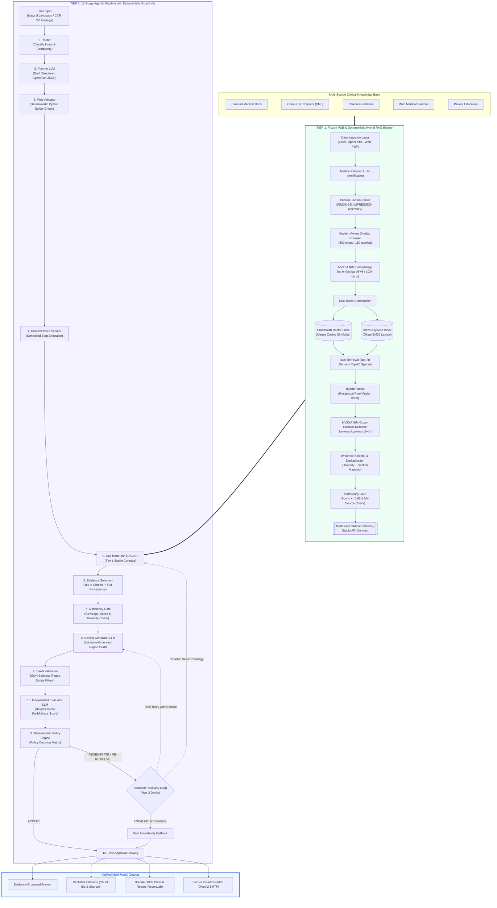

---

## 2. Tier 1 Reference: Frozen VDB & Deterministic Hybrid RAG

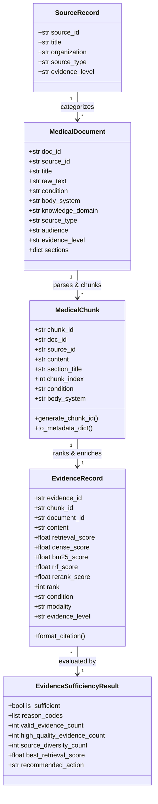

---

## 3. Tier 2 Reference: 13-Stage Agentic RAG Pipeline

```mermaid
flowchart TD
    subgraph STAGES ["13-Stage Execution Matrix"]
        S1["Stage 1: Intent & Complexity Router (LLM)"]
        S2["Stage 2: Planner (LLM) -> AgentPlan JSON Contract"]
        S3["Stage 3: Plan Validator (Deterministic Python)"]
        S4["Stage 4: Deterministic Executor (Python Controlled)"]
        S5["Stage 5: MediScan RAG API Call (Tier 1 Black Box)"]
        S6["Stage 6: Evidence Selection (Top-K + Provenance)"]
        S7["Stage 7: Sufficiency Gate (Deterministic Score Check)"]
        S8["Stage 8: Clinical Generator (LLM)"]
        S9["Stage 9: Tier-0 Validation (Python Schema/Regex)"]
        S10["Stage 10: Independent Evaluator (Dispassionate LLM)"]
        S11["Stage 11: Deterministic Policy Engine (Python)"]
        S12["Stage 12: Bounded Recovery Loop (Max 3 Drafts)"]
        S13["Stage 13: Post-Approval Delivery (PDF & Email)"]
    end

    S1 --> S2 --> S3 --> S4 --> S5 --> S6 --> S7 --> S8 --> S9 --> S10 --> S11
    S11 -->|"Fail (Score < 0.85)"| S12
    S12 -.->|"Regenerate"| S8
    S12 -.->|"Re-Retrieve"| S5
    S11 -->|"Pass (Score >= 0.85)"| S13

    classDef pyStyle fill:#e0f2fe,stroke:#0284c7,stroke-width:2px,color:#0369a1;
    classDef llmStyle fill:#f3e8ff,stroke:#9333ea,stroke-width:2px,color:#6b21a8;
    class S3,S4,S5,S6,S7,S9,S11,S12,S13 pyStyle;
    class S1,S2,S8,S10 llmStyle;
```

> **Legend**: 🔵 **Deterministic Python Code (Zero Hallucination)** | 🟣 **Controlled LLM Call (Enforced Contracts)**

---

## 4. Mathematical & Algorithmic Foundations

### 4.1 Hybrid Retrieval: Reciprocal Rank Fusion (RRF)
To balance semantic relevance (dense embeddings) and exact medical terminology (BM25 lexical search), candidate chunks are ranked by:

$$RRF(d) = \sum_{r \in R} \frac{1}{k + r(d)}$$

Where:
- $R$: Set of retrievers (Dense Cosine Similarity + Sparse Okapi BM25).
- $r(d)$: Rank of document $d$ within retriever $r$ ($1 \le r(d) \le 20$).
- $k$: Smoothing constant ($k = 60$).

### 4.2 Cross-Encoder Precision Reranking
Top-15 RRF fused chunks are evaluated via the NVIDIA NIM Cross-Encoder (`nv-rerankqa-mistral-4b`):

$$S_{\text{rerank}}(q, c) = \text{CrossEncoder}(q, c) \in [-\infty, +\infty] \xrightarrow{\text{sigmoid}} [0, 1]$$

### 4.3 Deterministic Sufficiency Metric
Evidence passes to the generator if and only if:

$$\text{Sufficiency} = \left( \max_{e \in E} S(e) \ge 0.65 \right) \land \left( |\{ \text{doc\_id}(e) \mid e \in E \}| \ge 1 \right) \land \left( |E| \ge 1 \right)$$

---

## 5. Architectural Flow

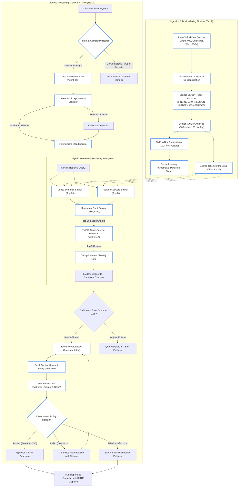

---

## 6. Clinical Work Flow

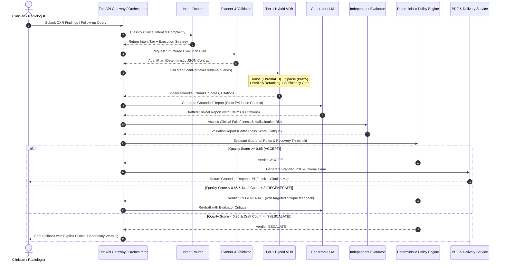

---

## 7. Operations Flow & Runtime State Machine

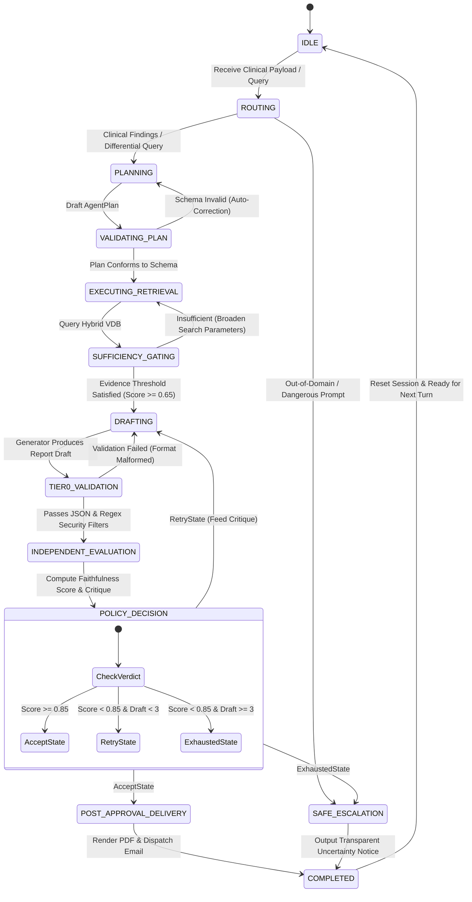

---

## 8. System Use Case Diagrams

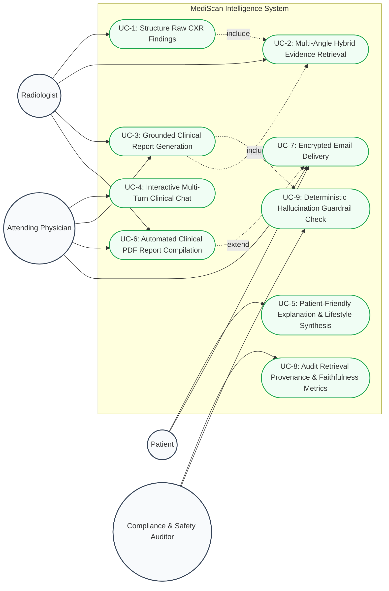

---

## 9. User Story Mapping & Requirements Hierarchy

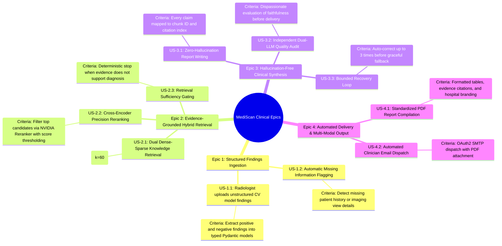

---

## 10. Core Safety & Clinical Guardrail Principles

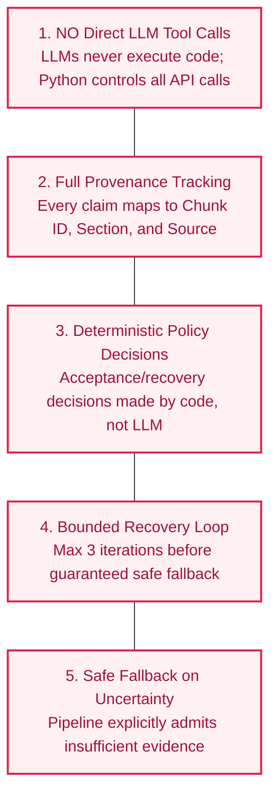

---

## 11. Data Sources & Storage Layout

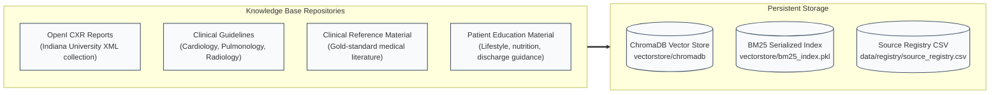

---

## 12. Technology Stack

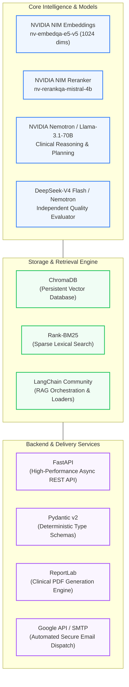

---

  Built with precision, safety, and deterministic evidence-grounding for clinical decision support.

