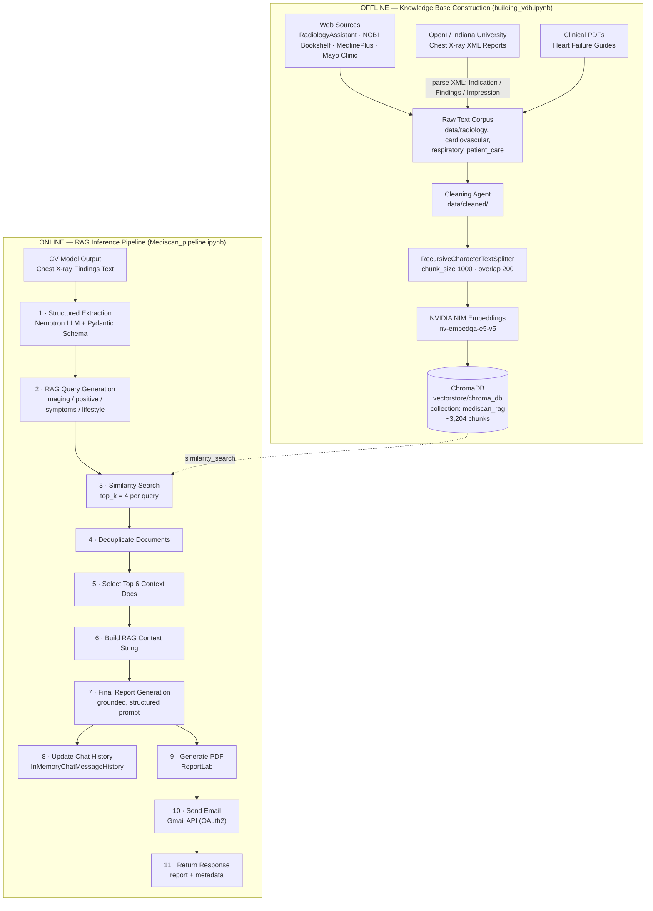
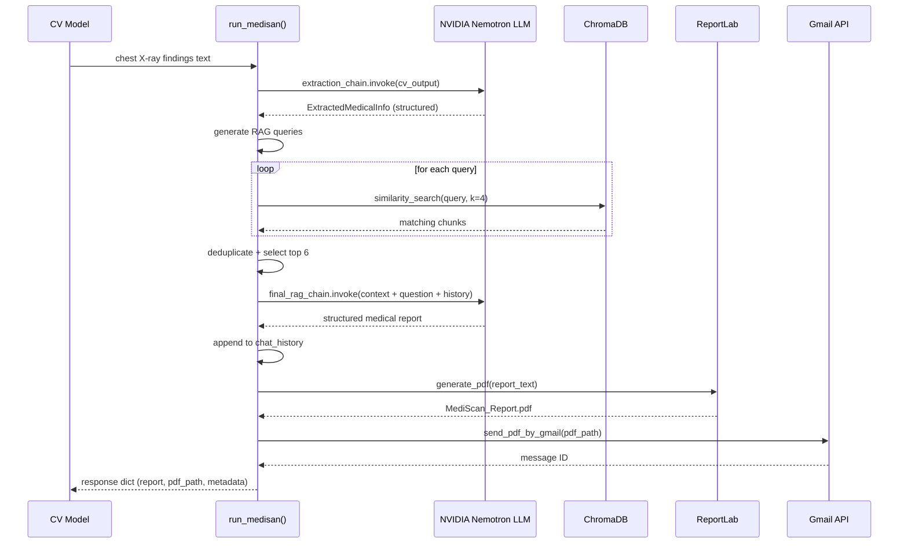

# MediScan — RAG-Powered Chest X-Ray Reporting Assistant

MediScan turns raw chest X-ray computer-vision (CV) findings into an evidence-grounded, structured medical report, then automatically packages it as a PDF and emails it to the patient/clinician. It is built as a **Retrieval-Augmented Generation (RAG)** system on top of **NVIDIA NIM** (LLM + embeddings), **ChromaDB**, and **LangChain**, with the knowledge base curated from radiology references, disease-specific clinical literature, patient-education material, and the OpenI/Indiana University chest X-ray report collection.

The project is split across two notebooks that represent the two halves of a RAG system:

| Notebook | Role |
|---|---|
| `src/building_vdb.ipynb` | **Offline** — collects, cleans, chunks, embeds, and indexes the medical knowledge base into a persistent ChromaDB vector store. |
| `src/Mediscan_pipeline.ipynb` | **Online** — takes a CV model's X-ray findings, extracts structured clinical facts, retrieves supporting evidence, generates a grounded report, and delivers it as a PDF via email. |

---

## Key Features

- **Structured extraction** of symptoms, imaging findings, positive/negative findings, patient info, and missing info from free-text CV output, using a Pydantic schema + NVIDIA Nemotron LLM.
- **Multi-angle RAG query generation** — every extracted finding is turned into several targeted retrieval queries (clinical significance, risk indicators, lifestyle/diet relevance).
- **Grounded generation** — the report-writing prompt explicitly forbids unsupported diagnoses, invented facts, and hallucinated treatment advice; it must defer to retrieved context and state uncertainty when evidence is insufficient.
- **Conversational memory** — an in-memory chat history lets the pipeline answer follow-up questions (e.g. "how has the patient's condition changed?") using prior turns.
- **End-to-end delivery** — the generated Markdown report is rendered into a formatted PDF (ReportLab) and emailed automatically via the Gmail API (OAuth2).
- **Curated multi-source knowledge base** — web-scraped radiology references, disease-specific clinical literature, patient-care/lifestyle guidance, and real de-identified chest X-ray reports (OpenI).

---

## System Architecture



**How the two halves connect:** the offline notebook is run once (or whenever the knowledge base needs refreshing) to produce the persistent `chroma_db` store. The online notebook simply *opens* that same store at runtime — it never writes to it. This separation means the knowledge base can be rebuilt/expanded independently of the reporting pipeline.

### Runtime call sequence



---

## Notebook Breakdown

### 1. `src/building_vdb.ipynb` — Knowledge Base Construction

| Section | Details |
|---|---|
| **Import Libraries** | Loads LangChain document loaders/splitters, `NVIDIAEmbeddings`, `Chroma`, and `xml.etree.ElementTree`; reads NVIDIA API credentials from `.env`. |
| **Loading Documents — Web Sources** | Scrapes general radiology-interpretation reference pages (RadiologyAssistant.nl basic/advanced chest X-ray interpretation, NCBI Bookshelf cardiovascular chapter) via `WebBaseLoader` and saves raw text per topic. |
| **Loading Documents — OpenI XML Reports** | Parses the Indiana University / Open-I chest X-ray report collection: for every XML file it extracts the `INDICATION`, `FINDINGS`, and `IMPRESSION` fields, skips unparsable files, and consolidates everything into a single `openi_reports.txt` corpus of real (de-identified) radiology reports. |
| **Loading Documents — Cardiovascular & Respiratory References** | Scrapes disease-specific clinical reference pages (NCBI Bookshelf, Wikipedia, MedlinePlus, Mayo Clinic) covering Heart Failure, Cardiomegaly, Pleural Effusion, Pulmonary Edema, Pericardial Effusion, Pneumonia, Pneumothorax, COPD, and Consolidation. |
| **Loading Documents — Patient Care / Lifestyle** | Scrapes patient-education pages (MedlinePlus, Cleveland Clinic diet guidance) and loads clinical PDF guides ("Living with Heart Failure", HFSA discharge module) via `PyPDFLoader`. |
| **Cleaning Stage** | Raw scraped/extracted text is cleaned by an LLM-based agent (run outside this notebook) to strip navigation boilerplate and noise; cleaned output is saved to `data/cleaned/`, which is the actual input to chunking. |
| **Chunking Stage** | Loads every cleaned `.txt` file with a `DirectoryLoader` and splits it with `RecursiveCharacterTextSplitter` (`chunk_size=1000`, `chunk_overlap=200`), then inspects chunk-size distribution and the smallest chunks for quality control. |
| **Embedding** | Sanity-checks the NVIDIA `nv-embedqa-e5-v5` embedding model on a sample sentence, then embeds every chunk in bulk. |
| **Building ChromaDB** | Persists all chunks + embeddings into a local ChromaDB collection (`mediscan_rag`) under `vectorstore/chroma_db` (~3,204 chunks), then validates retrieval quality with sample similarity searches (e.g. pleural effusion, pneumonia, pneumothorax, heart-failure lifestyle guidance). |

### 2. `src/Mediscan_pipeline.ipynb` — RAG Inference & Reporting Pipeline

| Section | Details |
|---|---|
| **Import Packages & Libraries** | Loads env vars, connects to the NVIDIA NIM embedding endpoint, and initializes an `InMemoryChatMessageHistory` used to carry context across follow-up questions. |
| **Load Persistent ChromaDB** | Re-opens the `chroma_db` collection built in `building_vdb.ipynb` as the retrieval backend for this pipeline. |
| **Synthetic CV Input** | A commented example chest X-ray finding text stands in for the real output of an upstream computer-vision model, documenting the expected input shape/format for the pipeline. |
| **Define Structured Schema** | A Pydantic `ExtractedMedicalInfo` model with six fields — `symptoms`, `imaging_findings`, `positive_findings`, `negative_findings`, `patient_information`, `missing_information` — that the extraction step must populate. |
| **Extraction Chain** | A `ChatPromptTemplate` + structured-output LLM (`ChatNVIDIA`, `nvidia/nvidia-nemotron-nano-9b-v2`, `temperature=0`) chain that pulls out only explicitly-stated clinical facts, with hard rules against diagnosing or inferring unstated history. |
| **RAG Query Generation** | Builds one retrieval query per extracted finding across four angles: imaging-finding significance, positive-finding risk indicators, symptom significance, and lifestyle/dietary relevance — then de-duplicates the query list. |
| **Similarity Search, Dedup & Context Selection** | For each query, retrieves the top-4 most similar chunks (`similarity_search`, `k=4`), removes duplicate chunks by content hash, and keeps the best 6 documents as final context. |
| **Build RAG Context** | Formats the selected chunks into a single labeled context block (`[Context N] / Source / content`) for the generation prompt. |
| **Final Report Generation** | A tightly-constrained prompt (`final_rag_prompt`) forces the LLM to output a fixed-structure Markdown report — Patient Information → Symptoms → Imaging Findings → Positive Findings → Negative Findings → Clinical Interpretation → Possible Explanations → Uncertainty & Limitations → Evidence Summary — grounded only in retrieved context and prior chat history, with explicit anti-hallucination rules. |
| **PDF Generation** | A ReportLab-based `generate_pdf()` function (also wrapped as a LangChain `@tool`) renders the Markdown report into a formatted A4 PDF, saved to `reports/MediScan_Report.pdf`. |
| **Gmail Tool** | OAuth2 authentication against the Gmail API (`credentials.json` / `token.json`, `gmail.send` scope) plus a `send_pdf_by_gmail()` function that emails the generated PDF as an attachment. |
| **Runtime Orchestrator — `run_medisan()`** | The single entry point that chains every step above: extraction → query generation → retrieval → dedup → context build → report generation → history update → PDF → email → returns a full result dict (`extracted_info`, `rag_queries`, `selected_docs`, `report_text`, `pdf_path`, `email_sent`, `chat_history_messages`, …). |
| **Example Runs** | Two end-to-end calls demonstrate the system: an initial synthetic chest X-ray case, and a **follow-up case for the same patient** that also exercises chat-history-aware reasoning for the question *"How has the patient's condition changed since the initial scan?"* |

---

## Knowledge Base Sources

| Category | Sources | Format |
|---|---|---|
| General radiology interpretation | RadiologyAssistant.nl, NCBI Bookshelf | Web scrape |
| Real chest X-ray reports | OpenI / Indiana University Chest X-ray Collection | XML → parsed text |
| Cardiovascular conditions | NCBI Bookshelf (Heart Failure, Cardiomegaly, Pleural Effusion, Pulmonary Edema, Pericardial Effusion) | Web scrape |
| Respiratory conditions | NCBI Bookshelf, Wikipedia, MedlinePlus, Mayo Clinic (Pneumonia, Pneumothorax, COPD, Consolidation, Pulmonary Edema) | Web scrape |
| Patient education / lifestyle | MedlinePlus, Cleveland Clinic | Web scrape |
| Discharge / self-care guides | Heart failure living/discharge guides | PDF |

---

## Tech Stack

| Layer | Technology |
|---|---|
| Orchestration | LangChain (`langchain-core`, `langchain-community`, `langchain-text-splitters`) |
| LLM | NVIDIA NIM — `nvidia/nvidia-nemotron-nano-9b-v2` (via `ChatNVIDIA`) |
| Embeddings | NVIDIA NIM — `nvidia/nv-embedqa-e5-v5` (via `NVIDIAEmbeddings`) |
| Vector store | ChromaDB (`langchain-chroma`), persisted locally |
| Structured output | Pydantic |
| Document loading | `WebBaseLoader`, `PyPDFLoader`, `DirectoryLoader`/`TextLoader`, `xml.etree.ElementTree` |
| PDF generation | ReportLab |
| Email delivery | Gmail API (`google-api-python-client`, OAuth2) |
| Config | `python-dotenv` |

---

## Project Structure

```
MediScan/
├── src/
│   ├── building_vdb.ipynb            # offline: knowledge base construction
│   ├── Mediscan_pipeline.ipynb       # online: RAG inference & reporting
│   └── .env                          # NVIDIA API keys
├── data/
│   ├── radiology/
│   │   └── ecgen-radiology/          # raw OpenI XML report files
│   ├── cardiovascular/
│   ├── respiratory/
│   ├── patient_care/
│   └── cleaned/                      # agent-cleaned text, input to chunking
├── vectorstore/
│   └── chroma_db/                    # persistent Chroma store (collection: mediscan_rag)
├── reports/
│   └── MediScan_Report.pdf           # latest generated report
├── credentials.json                  # Gmail OAuth client secret
└── token.json                        # Gmail OAuth token (created on first auth)
```

## Environment Variables

| Variable | Purpose |
|---|---|
| `EMBEDED_API_KEY` | NVIDIA NIM API key used for the embedding model. |
| `LLM_API_KEY` | NVIDIA NIM API key used for the chat/generation model. |
| `BASE_URL` | NVIDIA NIM base URL (`https://integrate.api.nvidia.com/v1`). |

Gmail delivery additionally requires a Google Cloud OAuth **`credentials.json`** (Gmail API enabled, `gmail.send` scope) placed at the project root; a `token.json` is generated automatically after the first interactive authentication.

## Example Usage

```python
result = run_medisan(
    cv_output=chest_xray_findings_text,   # raw output from the upstream CV model
    user_question="What do these chest X-ray findings suggest?"
)

print(result["report_text"])   # structured Markdown report
print(result["pdf_path"])      # path to the generated PDF
print(result["email_sent"])    # True if delivered successfully
```

Calling `run_medisan()` again for the same session reuses the shared `chat_history`, so follow-up questions (e.g. about a later follow-up scan) are answered with awareness of the earlier report.

---

## Design Notes & Guardrails

- The generation prompt explicitly forbids the model from introducing diagnoses, causes, or treatment advice that aren't backed by retrieved context, and requires it to state when evidence is insufficient or conflicting.
- Negative findings are never treated as ruling out a condition (e.g. absence of cardiomegaly ≠ heart failure ruled out) — this rule is hard-coded into the prompt.
- Retrieval is intentionally broad (4 angles × N findings, top-4 per query) then narrowed via dedup + top-6 selection, to bias toward recall first and precision second.
- The email recipient and a few filesystem paths are currently hardcoded in the notebook cells; before productionizing, these are natural candidates to move into `.env`/function arguments for portability.

## Disclaimer

This is a research/portfolio project demonstrating a RAG architecture for clinical report drafting. It is **not** a certified diagnostic device and its output should not be used for actual patient care without review by a licensed clinician.
