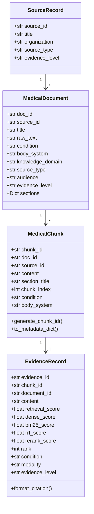
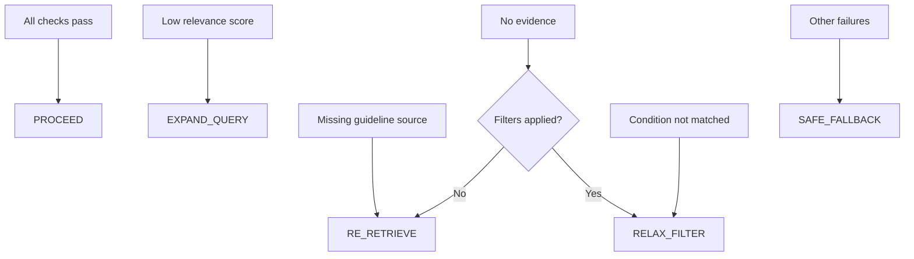
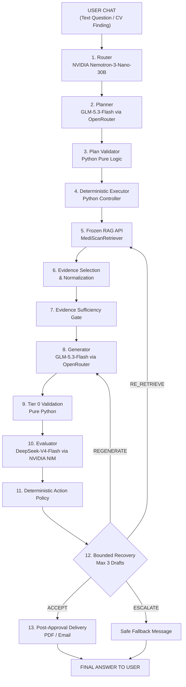

# MediScan — VDB & Medical Pipeline Documentation

> **Project**: MediScan — AI-Powered Intelligent Healthcare Data Engineering & Clinical Decision Support Platform  
> **Document Scope**: Full technical documentation of the **Vector Database (VDB)** subsystem and the **Medical_pipeline.ipynb** agentic RAG chatbot notebook.  
> **Last Updated**: August 27, 2026

---

## Table of Contents

1. [High-Level Architecture](#1-high-level-architecture)
2. [VDB Package — Complete Reference](#2-vdb-package--complete-reference)
   - 2.1 [Directory Structure](#21-directory-structure)
   - 2.2 [Configuration (`config.py`)](#22-configuration-configpy)
   - 2.3 [Data Models & Schema (`schema.py`)](#23-data-models--schema-schemapy)
   - 2.4 [Data Acquisition Layer](#24-data-acquisition-layer)
   - 2.5 [Data Processing Layer](#25-data-processing-layer)
   - 2.6 [Indexing Layer](#26-indexing-layer)
   - 2.7 [Retrieval Layer](#27-retrieval-layer)
   - 2.8 [Evaluation Layer](#28-evaluation-layer)
   - 2.9 [Unified Retrieval Engine (`pipeline.py`)](#29-unified-retrieval-engine-pipelinepy)
   - 2.10 [Legacy Utility Modules](#210-legacy-utility-modules)
3. [Medical_pipeline.ipynb — Agentic RAG Chatbot](#3-medical_pipelineipynb--agentic-rag-chatbot)
   - 3.1 [Architecture Flow (13-Stage Pipeline)](#31-architecture-flow-13-stage-pipeline)
   - 3.2 [Model Roles & Provider Split](#32-model-roles--provider-split)
   - 3.3 [Notebook Sections Breakdown](#33-notebook-sections-breakdown)
   - 3.4 [Core Safety Principles](#34-core-safety-principles)
4. [Data Sources & Knowledge Base](#4-data-sources--knowledge-base)
5. [Storage & Persistence](#5-storage--persistence)
6. [Hyperparameters & Tuning Reference](#6-hyperparameters--tuning-reference)
7. [API Quick Reference](#7-api-quick-reference)

---

## 1. High-Level Architecture

MediScan operates as a **two-tier system**:

```
┌─────────────────────────────────────────────────────────────────────┐
│                     TIER 1: FROZEN VDB & RAG                        │
│  (Deterministic, reproducible, no LLM side-effects)                 │
│                                                                     │
│  Data Acquisition → Cleaning → Section-Aware Chunking →             │
│  Dual Indexing (ChromaDB + BM25) → Hybrid Retrieval (RRF) →        │
│  NVIDIA Reranking → Evidence Selection → Sufficiency Gate           │
├─────────────────────────────────────────────────────────────────────┤
│                   TIER 2: AGENTIC RAG CHATBOT                       │
│  (Medical_pipeline.ipynb — operates ON TOP of Tier 1)               │
│                                                                     │
│  Router → Planner → Plan Validator → Deterministic Executor →       │
│  Generator → Tier 0 Validation → Evaluator → Policy Decision →     │
│  Bounded Recovery → Post-Approval Delivery (PDF / Email)            │
└─────────────────────────────────────────────────────────────────────┘
```

> [!IMPORTANT]
> The VDB/RAG layer (Tier 1) is **frozen** — its API contract is stable and does not change. The agentic chatbot (Tier 2) consumes the `MediScanRetriever.retrieve()` API as a black box.

---

## 2. VDB Package — Complete Reference

### 2.1 Directory Structure

```
src/VDB/
├── __init__.py                  # Package exports
├── config.py                    # Central configuration & paths
├── schema.py                   # All data models & typed contracts
├── pipeline.py                 # Unified retrieval engine & tool bridges
│
├── acquisition/                # Data ingestion layer
│   ├── __init__.py
│   ├── local_loader.py         # Load local cleaned .txt documents
│   ├── openi_loader.py         # Parse OpenI XML chest X-ray reports
│   ├── web_loader.py           # Download from web URLs
│   ├── pdf_loader.py           # Extract text from PDFs
│   └── registry.py             # Source registry management
│
├── processing/                 # Text preprocessing layer
│   ├── __init__.py
│   ├── cleaner.py              # Medical text normalization & boilerplate removal
│   ├── section_parser.py       # Clinical section header detection & extraction
│   └── chunker.py              # Section-aware document chunker
│
├── indexing/                   # Index building layer
│   ├── __init__.py
│   ├── embeddings.py           # NVIDIA NIM embedding provider
│   ├── vector_index.py         # ChromaDB dense vector store manager
│   ├── bm25_index.py           # BM25 sparse lexical index
│   └── index_builder.py        # Full knowledge base build orchestrator
│
├── retrieval/                  # Search & ranking layer
│   ├── __init__.py
│   ├── dense_retriever.py      # Semantic vector similarity retriever
│   ├── sparse_retriever.py     # BM25 lexical keyword retriever
│   ├── hybrid_fusion.py        # Reciprocal Rank Fusion (RRF) combiner
│   ├── reranker.py             # NVIDIA NIM cross-encoder reranker
│   ├── evidence_selector.py    # Deduplication, diversity & citation mapping
│   └── sufficiency_gate.py     # Deterministic evidence quality gate
│
├── evaluation/                 # Benchmarking layer
│   ├── __init__.py
│   ├── evaluator.py            # 4-way retrieval benchmark framework
│   └── test_queries.py         # Benchmark test cases & expected conditions
│
├── loader.py                   # (Legacy) Raw data loading from URLs/PDFs/XML
├── cleaning.py                 # (Legacy) Text cleaning pipeline
├── chunking.py                 # (Legacy) Document chunking with LangChain
├── embedding.py                # (Legacy) NVIDIA embedding initialization
├── vectorstore.py              # (Legacy) ChromaDB creation & loading
├── query.py                    # (Legacy) Similarity search helpers
├── load_external.py            # (Legacy) External source loader
└── run_vdb.py                  # (Legacy) One-shot VDB build script
```

---

### 2.2 Configuration (`config.py`)

[`config.py`](file:///c:/Users/merna/OneDrive/Desktop/Orange_training_AI_Agents/MediScan/src/VDB/config.py) centralizes all paths, API keys, model names, and hyperparameters.

| Category | Setting | Default Value |
|---|---|---|
| **Paths** | `VECTORSTORE_DIR` | `<project>/vectorstore/chromadb` |
| | `BM25_INDEX_PATH` | `<project>/vectorstore/bm25_index.pkl` |
| | `DATA_DIR` | `<project>/data` |
| | `CLEANED_DATA_DIR` | `<project>/data/cleaned` |
| | `OPENI_XML_DIR` | `<project>/data/radiology/ecgen-radiology` |
| | `SOURCE_REGISTRY_CSV` | `<project>/data/registry/source_registry.csv` |
| **NVIDIA NIM** | `EMBEDDING_MODEL` | `nvidia/llama-nemotron-embed-vl-1b-v2` |
| | `RERANKER_MODEL` | `nvidia/llama-nemotron-rerank-1b-v2` |
| | `NVIDIA_BASE_URL` | `https://integrate.api.nvidia.com/v1` |
| **OpenRouter** | `ROUTER_MODEL` | `nvidia/nemotron-3-nano-30b-a3b` |
| | `EVALUATOR_MODEL` | `deepseek-ai/deepseek-v4-flash-0731` |
| **Chunking** | `DEFAULT_CHUNK_SIZE` | `800` characters |
| | `DEFAULT_CHUNK_OVERLAP` | `150` characters |
| | `MAX_REPORT_CHUNK_SIZE` | `1000` characters |
| **Retrieval** | `DENSE_TOP_K` | `20` |
| | `SPARSE_TOP_K` | `20` |
| | `RERANK_TOP_K` | `5` |
| | `RRF_K_CONSTANT` | `60` |

> [!NOTE]
> All API keys are loaded from `src/.env` via `python-dotenv`. No secrets are hardcoded or printed.

---

### 2.3 Data Models & Schema (`schema.py`)

[`schema.py`](file:///c:/Users/merna/OneDrive/Desktop/Orange_training_AI_Agents/MediScan/src/VDB/schema.py) defines the canonical typed contracts for the entire VDB system. All dataclasses use Python `@dataclass` with type hints.

#### 2.3.1 Core Data Models



#### 2.3.2 `MedicalDocument` (alias: `DocumentRecord`)

Represents a single ingested medical document **before** chunking.

| Field | Type | Description |
|---|---|---|
| `doc_id` | `str` | Unique document identifier (e.g., `LOCAL_Pneumonia`, `OpenI_CXR1000`) |
| `source_id` | `str` | Source registry ID linking to the publisher/repository |
| `title` | `str` | Human-readable document title |
| `raw_text` | `str` | Full cleaned text content |
| `condition` | `str` | Primary medical condition tag (e.g., `Pneumonia`, `Heart_Failure`) |
| `body_system` | `str` | Anatomical system (`cardiovascular`, `respiratory`, `general`) |
| `knowledge_domain` | `str` | Domain category: `guidelines`, `clinical_references`, `cases`, `patient_education`, `research` |
| `source_type` | `str` | Document type: `guideline`, `reference`, `radiology_report`, `patient_education`, `case_report` |
| `audience` | `str` | Target audience: `clinician` or `patient` |
| `evidence_level` | `str` | Quality tier: `high`, `moderate`, `low`, `expert_consensus`, `case_report` |
| `sections` | `Dict[str, str]` | Named clinical sections (e.g., `{"FINDINGS": "...", "IMPRESSION": "..."}`) |

#### 2.3.3 `MedicalChunk` (alias: `ChunkRecord`)

A section-aware chunk with a **stable deterministic identifier**.

| Field | Type | Description |
|---|---|---|
| `chunk_id` | `str` | Deterministic ID: `{doc_id}#{SECTION}_{idx}` (e.g., `OpenI_CXR1000#FINDINGS_0`) |
| `content` | `str` | Chunked text content |
| `section_title` | `str` | Which clinical section this chunk belongs to (e.g., `FINDINGS`, `IMPRESSION`, `MAIN`) |
| `chunk_index` | `int` | Sequential index within the document |

Key method: **`to_metadata_dict()`** — Flattens all chunk metadata into a dictionary suitable for ChromaDB storage, including prefixing custom metadata keys with `meta_`.

#### 2.3.4 `EvidenceRecord`

The **canonical evidence object** preserving full provenance, multi-model retrieval scores, and clinical taxonomy.

**Multi-Retrieval Scores** (nullable where not applicable):
| Score Field | Source |
|---|---|
| `retrieval_score` | Primary composite score used for final ranking |
| `dense_score` | Vector cosine similarity from ChromaDB |
| `bm25_score` | Okapi BM25 lexical score |
| `rrf_score` | Reciprocal Rank Fusion composite |
| `rerank_score` | NVIDIA cross-encoder logit |

Key method: **`format_citation()`** — Produces a deterministic citation block ready for LLM context injection:
```
[EV-001] [OpenI_IU_CXR] OpenI Chest X-ray Report (CXR1000) (2013)
Provenance: OpenI_CXR1000#FINDINGS_0 | Domain: cases | Section: FINDINGS | Modality: CXR
Evidence Level: case_report | Audience: clinician
Content:
[actual medical text...]
```

#### 2.3.5 `RetrievalFilters`

Typed deterministic metadata filters for precision routing in ChromaDB:

| Filter Field | ChromaDB Mapping |
|---|---|
| `condition` | `{"condition": value}` |
| `body_system` | `{"body_system": value}` |
| `knowledge_domain` | `{"knowledge_domain": value}` |
| `source_type` | `{"source_type": value}` |
| `audience` | `{"audience": value}` |
| `modality` | `{"meta_modality": value}` |
| `evidence_level` | `{"evidence_level": value}` |

Multiple filters are combined with ChromaDB's `$and` operator.

#### 2.3.6 `EvidenceSufficiencyResult`

Result from the deterministic Evidence Sufficiency Gate:

| Field | Type | Description |
|---|---|---|
| `is_sufficient` | `bool` | Whether evidence passes all sufficiency criteria |
| `reason_codes` | `List[str]` | Machine-readable codes explaining the decision |
| `valid_evidence_count` | `int` | How many evidence records were retrieved |
| `high_quality_evidence_count` | `int` | Count of high/moderate/expert evidence |
| `source_diversity_count` | `int` | Number of distinct source documents |
| `best_retrieval_score` | `float` | Highest retrieval score among candidates |
| `recommended_action` | `str` | One of: `PROCEED`, `RE_RETRIEVE`, `EXPAND_QUERY`, `RELAX_FILTER`, `SAFE_FALLBACK`, `HUMAN_REVIEW` |

#### 2.3.7 `RetrievalResult`

The canonical public retrieval response:

| Field | Type | Description |
|---|---|---|
| `query` | `str` | Original search query |
| `retrieval_mode` | `str` | Which mode was used (`dense`, `bm25`, `hybrid`, `hybrid_reranked`) |
| `results` | `List[EvidenceRecord]` | Final ranked evidence records |
| `total_candidates` | `int` | Total candidates before selection |
| `returned_count` | `int` | Final count after selection |
| `filters_applied` | `Dict` | Active metadata filters |
| `reranking_applied` | `bool` | Whether NVIDIA reranker was used |
| `sufficiency` | `EvidenceSufficiencyResult` | Gate evaluation result |
| `latency_ms` | `float` | End-to-end retrieval latency |
| `retrieval_trace` | `Dict` | Diagnostic trace with timing per stage |

#### 2.3.8 Enums

| Enum | Values |
|---|---|
| `RetrievalMode` | `DENSE`, `BM25`, `HYBRID`, `HYBRID_RERANKED` |
| `RecommendedAction` | `PROCEED`, `RE_RETRIEVE`, `EXPAND_QUERY`, `RELAX_FILTER`, `SAFE_FALLBACK`, `HUMAN_REVIEW` |

---

### 2.4 Data Acquisition Layer

Located in [`src/VDB/acquisition/`](file:///c:/Users/merna/OneDrive/Desktop/Orange_training_AI_Agents/MediScan/src/VDB/acquisition).

#### 2.4.1 Local Loader ([`local_loader.py`](file:///c:/Users/merna/OneDrive/Desktop/Orange_training_AI_Agents/MediScan/src/VDB/acquisition/local_loader.py))

Loads all cleaned `.txt` documents from `data/cleaned/` into `MedicalDocument` objects.

**Key Features:**
- **Path-based domain inference**: Automatically infers `condition`, `body_system`, `knowledge_domain`, `source_type`, and `audience` from the file path.
- **Condition detection**: Matches against known conditions (Pneumonia, Pleural Effusion, COPD, Heart Failure, etc.)
- **Body system inference**: Detects cardiovascular, respiratory, neurology, gastrointestinal, renal, and oncology from path keywords.
- **Skips** the legacy combined `openi_reports.txt` (individual XML parsing is preferred).
- **Minimum content threshold**: Files under 50 characters are skipped.

**Supported body systems**: cardiovascular, respiratory, neurology, gastrointestinal, renal, oncology, general.

**Supported knowledge domains**: guidelines, clinical_references, patient_education, research, cases, radiology_reference.

#### 2.4.2 OpenI XML Loader ([`openi_loader.py`](file:///c:/Users/merna/OneDrive/Desktop/Orange_training_AI_Agents/MediScan/src/VDB/acquisition/openi_loader.py))

Parses **individual** OpenI chest X-ray XML reports from the Indiana University collection.

**XML Section Extraction:**
- `INDICATION` — Clinical reason for the exam
- `FINDINGS` — Radiologic observations
- `IMPRESSION` — Radiologist's conclusion
- `COMPARISON` — Comparison with prior studies
- `MeSH terms` — Medical Subject Heading keywords

**Condition Auto-Tagging** (`infer_condition_from_report()`):

| Detected Keywords | Assigned Condition |
|---|---|
| pneumothorax | `Pneumothorax` |
| effusion | `Pleural_Effusion` |
| pneumonia, consolidation, infiltrate | `Pneumonia` |
| edema, congestion | `Pulmonary_Edema` |
| cardiomegaly, enlarged heart | `Cardiomegaly` |
| copd, emphysema | `COPD` |
| nodule, mass, granuloma | `Pulmonary_Nodules` |
| normal, no acute, unremarkable | `Normal_CXR` |
| *(fallback)* | `Chest_Radiology` |

Each report becomes an independent `MedicalDocument` with:
- `doc_id`: `OpenI_{uid}`
- `source_id`: `OpenI_IU_CXR`
- `knowledge_domain`: `cases`
- `source_type`: `radiology_report`
- `modality`: `CXR` (stored in metadata)

#### 2.4.3 Web & PDF Loaders

- [`web_loader.py`](file:///c:/Users/merna/OneDrive/Desktop/Orange_training_AI_Agents/MediScan/src/VDB/acquisition/web_loader.py) — Downloads web pages using LangChain's `WebBaseLoader`.
- [`pdf_loader.py`](file:///c:/Users/merna/OneDrive/Desktop/Orange_training_AI_Agents/MediScan/src/VDB/acquisition/pdf_loader.py) — Extracts text from PDFs using LangChain's `PyPDFLoader`.

---

### 2.5 Data Processing Layer

Located in [`src/VDB/processing/`](file:///c:/Users/merna/OneDrive/Desktop/Orange_training_AI_Agents/MediScan/src/VDB/processing).

#### 2.5.1 Text Cleaner ([`cleaner.py`](file:///c:/Users/merna/OneDrive/Desktop/Orange_training_AI_Agents/MediScan/src/VDB/processing/cleaner.py))

`clean_medical_text(raw_text)` performs:

1. **Unicode normalization** — Replaces smart quotes, em-dashes, non-breaking spaces, zero-width characters.
2. **Boilerplate removal** — Strips cookie banners, newsletter prompts, navigation links, government website headers, social media links, and advertisement markers via 7 regex patterns.
3. **Decorative separator cleanup** — Removes lines of repeated dashes, equals, underscores, tildes.
4. **Standalone URL removal** — Strips lines containing only URLs (no semantic value).
5. **Whitespace normalization** — Collapses multiple spaces and excessive newlines.

> [!TIP]
> The cleaner **preserves** all clinical content, medical abbreviations, and section structure. Only web boilerplate and formatting artifacts are removed.

#### 2.5.2 Section Parser ([`section_parser.py`](file:///c:/Users/merna/OneDrive/Desktop/Orange_training_AI_Agents/MediScan/src/VDB/processing/section_parser.py))

`split_text_into_sections(text)` detects and splits medical text into structured sections.

**Recognized clinical section headers** (case-insensitive):
- `INDICATION`, `CLINICAL INDICATION`, `REASON FOR EXAM`
- `FINDINGS`, `RADIOLOGIC FINDINGS`, `IMAGING FINDINGS`, `OBSERVATIONS`
- `IMPRESSION`, `CONCLUSION`, `SUMMARY`, `RECOMMENDATION`
- `COMPARISON`, `TECHNIQUE`, `PROCEDURE`
- `DIAGNOSIS`, `DIAGNOSTIC CRITERIA`, `DIFFERENTIAL DIAGNOSIS`
- `PATHOPHYSIOLOGY`, `ETIOLOGY`, `EPIDEMIOLOGY`
- `TREATMENT`, `MANAGEMENT`, `THERAPY`, `MEDICATION`
- `CASE PRESENTATION`, `HISTORY OF PRESENT ILLNESS`, `PHYSICAL EXAMINATION`
- `OVERVIEW`, `INTRODUCTION`, `BACKGROUND`
- `OUTCOME`, `FOLLOW-UP`, `COMPLICATIONS`

If no section headers are detected, all text is placed under a single `MAIN` section.

#### 2.5.3 Section-Aware Chunker ([`chunker.py`](file:///c:/Users/merna/OneDrive/Desktop/Orange_training_AI_Agents/MediScan/src/VDB/processing/chunker.py))

`SectionAwareChunker` creates `MedicalChunk` objects with stable, deterministic `chunk_id`s.

**Two chunking strategies:**

| Document Type | Strategy |
|---|---|
| **Radiology Reports** (`source_type == "radiology_report"`) | Atomic approach: If the full report fits within `MAX_REPORT_CHUNK_SIZE` (1000 chars), create a single `FULL_REPORT` chunk. Otherwise, chunk each section (FINDINGS, IMPRESSION, etc.) individually. |
| **General Documents** (guidelines, research, references) | Extract sections first using `section_parser`, then apply `RecursiveCharacterTextSplitter` per section. Each chunk is prefixed with `[Document Title - Section Name]`. |

**Chunk ID format**: `{doc_id}#{SECTION_TITLE}_{chunk_index}` (e.g., `OpenI_CXR1000#FINDINGS_0`)

**Splitter config**:
- Separators: `["\n\n", "\n", ". ", "; ", ", ", " "]`
- Chunk size: 800 characters (default)
- Overlap: 150 characters (default)

---

### 2.6 Indexing Layer

Located in [`src/VDB/indexing/`](file:///c:/Users/merna/OneDrive/Desktop/Orange_training_AI_Agents/MediScan/src/VDB/indexing).

#### 2.6.1 Embedding Provider ([`embeddings.py`](file:///c:/Users/merna/OneDrive/Desktop/Orange_training_AI_Agents/MediScan/src/VDB/indexing/embeddings.py))

- **Model**: `nvidia/llama-nemotron-embed-vl-1b-v2` (via NVIDIA NIM)
- **Provider**: `langchain_nvidia_ai_endpoints.NVIDIAEmbeddings`
- **Batch embedding**: `embed_texts_with_retry()` processes texts in batches of 100 with exponential backoff retry (max 3 attempts).

#### 2.6.2 ChromaDB Dense Vector Index ([`vector_index.py`](file:///c:/Users/merna/OneDrive/Desktop/Orange_training_AI_Agents/MediScan/src/VDB/indexing/vector_index.py))

`ChromaVectorIndex` manages the persistent ChromaDB vector store.

| Method | Description |
|---|---|
| `add_chunks(chunks, batch_size=25)` | Inserts `MedicalChunk` objects in batches, using `chunk_id` as the ChromaDB document ID. |
| `similarity_search_with_score(query, k, filter_obj)` | Runs vector similarity search with optional metadata filtering. Returns `List[Tuple[MedicalChunk, float]]`. |
| `count()` | Returns total chunks in the collection. |

**Score normalization**: ChromaDB returns raw distance. The system converts to similarity: `score = 1.0 / (1.0 + distance)`.

**Collection name**: `mediscan_rag`  
**Persistence**: `<project>/vectorstore/chromadb/` (SQLite-backed, ~24 MB)

#### 2.6.3 BM25 Sparse Lexical Index ([`bm25_index.py`](file:///c:/Users/merna/OneDrive/Desktop/Orange_training_AI_Agents/MediScan/src/VDB/indexing/bm25_index.py))

`BM25Index` provides exact term and medical acronym matching using `rank_bm25.BM25Okapi`.

| Method | Description |
|---|---|
| `build_index(chunks)` | Tokenizes all chunk contents and builds the BM25 model. |
| `search(query, k, filter_obj)` | Runs BM25 scoring with post-hoc metadata filtering. |
| `save()` / `load()` | Serializes/deserializes to `vectorstore/bm25_index.pkl` (~4 MB). |

**Tokenization** (`tokenize_medical_text()`): Extracts all alphanumeric tokens ≥2 characters using regex `\b[A-Za-z0-9\-_]{2,}\b`, lowercased. Preserves clinical abbreviations (e.g., "COPD", "CXR", "pH").

#### 2.6.4 Index Builder ([`index_builder.py`](file:///c:/Users/merna/OneDrive/Desktop/Orange_training_AI_Agents/MediScan/src/VDB/indexing/index_builder.py))

`build_complete_knowledge_index()` orchestrates the full pipeline:

```
Step 1: Load local reference & guideline documents (local_loader)
Step 2: Load independent OpenI XML reports (openi_loader, default max=500)
Step 3: Section-aware chunking with stable chunk_ids (SectionAwareChunker)
Step 4: Build ChromaDB dense vector index (ChromaVectorIndex)
Step 5: Build BM25 sparse lexical index (BM25Index)
```

---

### 2.7 Retrieval Layer

Located in [`src/VDB/retrieval/`](file:///c:/Users/merna/OneDrive/Desktop/Orange_training_AI_Agents/MediScan/src/VDB/retrieval).

#### 2.7.1 Dense Retriever ([`dense_retriever.py`](file:///c:/Users/merna/OneDrive/Desktop/Orange_training_AI_Agents/MediScan/src/VDB/retrieval/dense_retriever.py))

Performs **semantic vector similarity search** over ChromaDB. Converts raw `(MedicalChunk, float)` pairs from ChromaDB into fully-populated `EvidenceRecord` objects with `dense_score` set.

#### 2.7.2 Sparse Retriever ([`sparse_retriever.py`](file:///c:/Users/merna/OneDrive/Desktop/Orange_training_AI_Agents/MediScan/src/VDB/retrieval/sparse_retriever.py))

Performs **exact term and acronym matching** via BM25. Converts `(MedicalChunk, float)` pairs from BM25 into `EvidenceRecord` objects with `bm25_score` set.

#### 2.7.3 Hybrid Fusion ([`hybrid_fusion.py`](file:///c:/Users/merna/OneDrive/Desktop/Orange_training_AI_Agents/MediScan/src/VDB/retrieval/hybrid_fusion.py))

Combines Dense and Sparse retrieval results using **Reciprocal Rank Fusion (RRF)**.

**RRF Formula:**
```
RRF_score(d) = Σ_{m ∈ models} 1 / (k_constant + rank_m(d))
```

Where `k_constant = 60` (configurable). This formula:
- Gives higher scores to documents ranked highly by **multiple** retrievers.
- Mitigates the impact of any single retriever's failures.
- Preserves both `dense_score` and `bm25_score` on the fused `EvidenceRecord`.

#### 2.7.4 NVIDIA Reranker ([`reranker.py`](file:///c:/Users/merna/OneDrive/Desktop/Orange_training_AI_Agents/MediScan/src/VDB/retrieval/reranker.py))

`NvidiaReranker` uses the **NVIDIA NIM cross-encoder** (`nvidia/llama-nemotron-rerank-1b-v2`) to re-score candidate passages against the query.

**Process:**
1. Takes fused candidate `EvidenceRecord`s and the original query.
2. Sends passages to the NVIDIA `/ranking` endpoint.
3. Receives logit scores from the cross-attention model.
4. Re-sorts candidates by logit score and updates `rerank_score` and `retrieval_score`.
5. Falls back gracefully to the input ranking if the API fails.

**Timeout**: 15 seconds.

#### 2.7.5 Evidence Selector ([`evidence_selector.py`](file:///c:/Users/merna/OneDrive/Desktop/Orange_training_AI_Agents/MediScan/src/VDB/retrieval/evidence_selector.py))

`EvidenceSelector.select_evidence()` performs **two-pass selection**:

| Pass | Purpose |
|---|---|
| **Pass 1: Diversity** | Selects candidates prioritizing unique `document_id`s. If diversity is preferred, skips chunks from already-seen documents until `max_results` slots are filled. |
| **Pass 2: Backfill** | If diversity filtering left empty slots, fills them with the next best-scoring chunks regardless of document origin. |

After selection, assigns deterministic citation IDs: `[EV-001]`, `[EV-002]`, etc.

#### 2.7.6 Evidence Sufficiency Gate ([`sufficiency_gate.py`](file:///c:/Users/merna/OneDrive/Desktop/Orange_training_AI_Agents/MediScan/src/VDB/retrieval/sufficiency_gate.py))

`EvidenceSufficiencyGate` is a **100% deterministic, Python-only** evaluator (no LLM calls) that decides whether retrieved evidence is reliable enough for downstream generation.

**Evaluation Criteria:**

| Check | Failure Code |
|---|---|
| Empty result set | `NO_EVIDENCE_RETRIEVED` |
| Insufficient chunk count (min 1, min 2 for comparisons) | `INSUFFICIENT_CHUNK_COUNT_X_OF_Y` |
| Best score below threshold (default 0.005) | `LOW_RELEVANCE_SCORE_BEST_X_BELOW_Y` |
| Guideline queries with no guideline sources | `MISSING_REQUIRED_GUIDELINE_SOURCE` |
| Patient queries with no patient-facing sources | `NO_PATIENT_SPECIFIC_SOURCE_FOUND` |
| Comparison queries with < 2 distinct documents | `INSUFFICIENT_SOURCE_DIVERSITY_FOR_COMPARISON` |
| Filter condition not matched in results | `CONDITION_NOT_MATCHED_IN_TOP_RESULTS` |
| Filter modality not matched in results | `MODALITY_NOT_MATCHED_IN_TOP_RESULTS` |

**Recommended Actions** (computed deterministically based on failure codes):



---

### 2.8 Evaluation Layer

Located in [`src/VDB/evaluation/`](file:///c:/Users/merna/OneDrive/Desktop/Orange_training_AI_Agents/MediScan/src/VDB/evaluation).

#### [`evaluator.py`](file:///c:/Users/merna/OneDrive/Desktop/Orange_training_AI_Agents/MediScan/src/VDB/evaluation/evaluator.py)

A comprehensive **4-way retrieval benchmark framework** that tests all retrieval modes (`dense`, `bm25`, `hybrid`, `hybrid_reranked`) against predefined benchmark cases.

**Metrics Calculated:**
- Precision@1, Precision@3, Precision@5
- Recall@3, Recall@5
- MRR (Mean Reciprocal Rank)
- nDCG@5 (Normalized Discounted Cumulative Gain with graded relevance: 0=irrelevant, 1=weak, 2=relevant, 3=direct evidence)
- Latency: Average, P50 (median), P95 (ms)
- Sufficiency Pass Rate (%)
- Source Diversity and Candidate Counts

**Exports**: `data/evaluation/retrieval_benchmark_results.csv` and `data/evaluation/retrieval_case_results.csv`

#### [`test_queries.py`](file:///c:/Users/merna/OneDrive/Desktop/Orange_training_AI_Agents/MediScan/src/VDB/evaluation/test_queries.py)

Contains `BENCHMARK_CASES` — a curated list of clinical test queries with expected conditions, keywords, and relevance judgments.

---

### 2.9 Unified Retrieval Engine (`pipeline.py`)

[`pipeline.py`](file:///c:/Users/merna/OneDrive/Desktop/Orange_training_AI_Agents/MediScan/src/VDB/pipeline.py) provides the **single canonical retrieval entrypoint** via `MediScanRetriever`.

#### `MediScanRetriever` Class

**Constructor** initializes all sub-components:
```python
MediScanRetriever(
    vector_index=None,       # ChromaVectorIndex (auto-created)
    bm25_index=None,         # BM25Index (auto-loaded)
    enable_reranker=True,    # NVIDIA cross-encoder reranker
)
```

**Primary API: `retrieve()`**

```python
def retrieve(
    query: str,
    *,
    mode: RetrievalMode = HYBRID_RERANKED,
    k: int = 5,
    filters: Optional[RetrievalFilters] = None,
    require_sufficient_evidence: bool = True,
    query_type: str = "direct",
) -> RetrievalResult
```

**Internal Pipeline (3 steps):**

| Step | Action |
|---|---|
| **1. Candidate Generation** | Generates `k × 4` (min 20) candidates using the selected mode. For hybrid modes, runs both dense and sparse retrieval, then fuses with RRF. For hybrid_reranked, applies NVIDIA cross-encoder reranking. |
| **2. Evidence Selection** | Deduplicates, applies source diversity preference, and assigns `[EV-001]` citation IDs. |
| **3. Sufficiency Gate** | Evaluates evidence quality, relevance alignment, and source diversity. Returns `EvidenceSufficiencyResult` with recommended actions. |

**Pre-Wired Tool Bridges** (ready for downstream agent consumption):

| Method | Tool Purpose | Filters Applied |
|---|---|---|
| `search_guidelines(query, condition, k)` | Clinical guideline lookup | `knowledge_domain="guidelines"` |
| `search_cases(query, condition, modality, k)` | Radiology report matching | `knowledge_domain="cases"` |
| `search_patient_education(query, condition, k)` | Patient-facing guides | `knowledge_domain="patient_education"` |
| `search_radiology(findings_query, k)` | CXR report matching | `modality="CXR"` |
| `get_grounded_context(query, k, filters)` | Returns formatted evidence string ready for LLM prompt injection | *(user-specified)* |

---

### 2.10 Legacy Utility Modules

These files in the VDB root contain the **original notebook logic** refactored into standalone scripts. They are preserved for backward compatibility but the modular `acquisition/`, `processing/`, `indexing/`, and `retrieval/` subpackages are the canonical implementation.

| File | Purpose |
|---|---|
| [`loader.py`](file:///c:/Users/merna/OneDrive/Desktop/Orange_training_AI_Agents/MediScan/src/VDB/loader.py) | Original data loading (URLs, PDFs, OpenI XML extraction) with hardcoded source URLs |
| [`cleaning.py`](file:///c:/Users/merna/OneDrive/Desktop/Orange_training_AI_Agents/MediScan/src/VDB/cleaning.py) | Text cleaning pipeline for `data/external_sources/` → `data/cleaned/` |
| [`chunking.py`](file:///c:/Users/merna/OneDrive/Desktop/Orange_training_AI_Agents/MediScan/src/VDB/chunking.py) | LangChain `DirectoryLoader` + `RecursiveCharacterTextSplitter` |
| [`embedding.py`](file:///c:/Users/merna/OneDrive/Desktop/Orange_training_AI_Agents/MediScan/src/VDB/embedding.py) | NVIDIA embedding model initialization and test |
| [`vectorstore.py`](file:///c:/Users/merna/OneDrive/Desktop/Orange_training_AI_Agents/MediScan/src/VDB/vectorstore.py) | ChromaDB creation (`from_documents`) and loading |
| [`query.py`](file:///c:/Users/merna/OneDrive/Desktop/Orange_training_AI_Agents/MediScan/src/VDB/query.py) | Similarity search helpers and demo queries |

---

## 3. Medical_pipeline.ipynb — Agentic RAG Chatbot

[`Medical_pipeline.ipynb`](file:///c:/Users/merna/OneDrive/Desktop/Orange_training_AI_Agents/MediScan/Medical_pipeline.ipynb) implements the **conversational agentic RAG tier** (Tier 2) of MediScan, operating on top of the frozen VDB foundation.

### 3.1 Architecture Flow (13-Stage Pipeline)



### 3.2 Model Roles & Provider Split

| Role | Model | Provider | Temperature | Purpose |
|---|---|---|---|---|
| **Router** | `nvidia/nemotron-3-nano-30b-a3b` | NVIDIA NIM | 0.0 | Intent classification & routing hints |
| **Planner** | `z-ai/glm-5.3-flash` | OpenRouter | 0.0 | Produces structured `AgentPlan` ONLY (no tool execution) |
| **Generator** | `z-ai/glm-5.3-flash` | OpenRouter | 0.1 | Generates grounded clinical report (separate isolated call) |
| **Evaluator** | `deepseek-ai/deepseek-v4-flash-0731` | NVIDIA NIM | 0.0 | Independent structured quality assessment |
| **Embeddings** | `nvidia/llama-nemotron-embed-vl-1b-v2` | NVIDIA NIM | — | Vector embeddings for ChromaDB |
| **Reranker** | `nvidia/llama-nemotron-rerank-1b-v2` | NVIDIA NIM | — | Cross-encoder passage reranking |

### 3.3 Notebook Sections Breakdown

| Section | Title | Description |
|---|---|---|
| **1** | Configuration & Environment Setup | Loads `.env`, sets paths, initializes project root |
| **2** | Model Provider Initialization | Creates 4 LLM interfaces (Router, Planner, Generator, Evaluator) |
| **3** | Session / Chat History | `ChatSessionStore` — in-memory multi-turn conversation store with formatting (max 5 turns) |
| **4** | Structured Clinical Information Schema | `ExtractedMedicalInfo` Pydantic model with fields: symptoms, imaging_findings, positive_findings, negative_findings, patient_information, missing_information |
| **5** | Clinical Entity Extraction | LangChain extraction chain using Planner LLM + structured output to parse clinical entities from user input |
| **5.5** | DeepSeek JSON Compatibility | `invoke_json_model()` — robust JSON extraction helper that handles markdown fences, validates against Pydantic schemas, works around DeepSeek's non-standard structured output |
| **6** | Router | `RouterDecision` schema with `query_type`, `language`, `complexity`, `suggested_retrieval_mode`. Deterministic fallback if LLM fails |
| **7** | AgentPlan Schema | Pydantic model with: `intent` (EXPLAIN, INTERPRET, COMPARE, GUIDELINE, EDUCATIONAL, FOLLOW_UP, GENERAL_MEDICAL), `retrieval_mode` (BM25, HYBRID, HYBRID_RERANKED), `queries` (1-3 focused search queries), `tools`, `needs_evidence`, `needs_guideline`, `needs_history`, `response_type`, `reason` |
| **8** | GLM-5.3-Flash Planner | Converts user message + extracted info + router hints + history into a structured `AgentPlan`. Falls back to router-guided default plan on failure. |
| **9** | Plan Validation | Pure Python validator: enforces allowed tool whitelist (`MedicalRAGTool`, `ClinicalGuidelineTool`, `PatientHistoryTool`, `SimilarCaseTool`, `RiskAssessmentTool`, `ReportGeneratorTool`), ensures queries exist, caps at 4 queries max |
| **10-11** | Frozen RAG Retrieval API | `execute_retrieval()` — runs multi-query retrieval through `MediScanRetriever.retrieve()`, deduplicates across queries, re-sorts by score |
| **12-15** | Citation Mapping & Sufficiency | `select_and_map_citations()` assigns `[EV-001]` IDs; `check_evidence_sufficiency()` verifies evidence adequacy |
| **16** | GLM-5.3-Flash Generator | Produces the final medical report with mandatory sections: Clinical Summary, Imaging Findings & Interpretation, Differential & Clinical Significance, Uncertainty & Limitations, Evidence Citations, and MediScan Disclaimer |
| **17** | Tier 0 Deterministic Validation | Pure Python checks: non-empty (≥50 chars), disclaimer present, citation IDs valid (no phantom `[EV-XXX]`), proper heading structure |
| **18** | DeepSeek-V4-Flash Evaluator | Scores the draft on 5 dimensions (0.0-1.0): `groundedness`, `citation_validity`, `answer_relevance`, `context_sufficiency`, `safety_compliance`. Suggests action: ACCEPT, REGENERATE, RE_RETRIEVE, ESCALATE |
| **19-20** | Action Policy & Recovery | Pure Python deterministic policy: safety < 0.80 → ESCALATE, insufficiency + attempt 1 → RE_RETRIEVE, low scores + attempts remaining → REGENERATE, all scores pass → ACCEPT. Max 3 drafts. |
| **21** | PDF Generation | ReportLab-based professional A4 PDF with header/footer, metadata table, markdown-to-PDF conversion, citation styling, disclaimer box |
| **22** | Email Delivery | Gmail API via OAuth2 — sends approved PDF as attachment. Only fires on `ACCEPT` policy action. Uses `credentials.json` + `token.json` |
| **23** | Top-Level `chat()` API | `ChatResponse` dataclass; unified entry point orchestrating all 13 stages with full trace logging |
| **24** | Interactive Chat Loop | Console-based demo chat loop |
| **25** | Validation Tests | 15 comprehensive test scenarios covering unit tests, deterministic policy tests, and end-to-end integration tests |

### 3.4 Core Safety Principles

> [!CAUTION]
> These are **non-negotiable architectural constraints** enforced throughout the pipeline:

1. **Separation of Concerns**: The Planner plans; Python executes; LLMs have **ZERO side effects** (no tool calling, no file I/O).
2. **Deterministic Control**: Policy actions (`ACCEPT`, `REGENERATE`, `RE_RETRIEVE`, `ESCALATE`) are computed in **Python code, never by the LLM**.
3. **Traceable Citations**: Every claim is mapped to explicit `[EV-001]` citation IDs backed by `EvidenceRecord` objects with full provenance.
4. **Gated Delivery**: PDF and Email can **NEVER** be triggered on rejected or escalated drafts. Only `ACCEPT` action unlocks delivery.
5. **Bounded Recovery**: Maximum 3 draft attempts. After 3 failures → automatic `ESCALATE` with safe fallback message.
6. **Evidence-Grounded Generation**: The Generator prompt explicitly forbids inventing diagnoses, treatments, or patient facts. It must rely ONLY on retrieved evidence.

---

## 4. Data Sources & Knowledge Base

| Domain | Source | Type | Files |
|---|---|---|---|
| **Radiology** | Radiology Assistant (NL) | Web Reference | `basic_interpretation.txt`, `lung_disease.txt` |
| | NCBI Books | Web Reference | `cardiovascular_cxr.txt` |
| | **OpenI / IU CXR Collection** | XML Reports | ~3,955 individual chest X-ray reports |
| **Cardiovascular** | NCBI StatPearls | Clinical Reference | Heart Failure, Cardiomegaly, Pleural Effusion, Pulmonary Edema, Pericardial Effusion |
| **Respiratory** | NCBI, MedlinePlus, Wikipedia, Mayo Clinic | Mixed | Pneumonia, Pneumothorax, COPD, Pulmonary Edema, Consolidation |
| **Patient Care** | MedlinePlus, Cleveland Clinic | Patient Education | Heart Failure, COPD, Pneumonia, Heart Failure Diet |

---

## 5. Storage & Persistence

| Artifact | Location | Size | Format |
|---|---|---|---|
| **ChromaDB Vector Store** | `vectorstore/chromadb/` | ~24 MB | SQLite + UUID directory |
| **BM25 Index** | `vectorstore/bm25_index.pkl` | ~4 MB | Python Pickle |
| **Cleaned Documents** | `data/cleaned/` | Variable | `.txt` files organized by domain |
| **OpenI XML Reports** | `data/radiology/ecgen-radiology/` | Variable | Individual `.xml` files |
| **Source Registry** | `data/registry/source_registry.csv` | Small | CSV |
| **Generated Reports** | `reports/` | Variable | PDF (timestamped) |
| **Environment Config** | `src/.env` | ~1 KB | Dotenv |

---

## 6. Hyperparameters & Tuning Reference

| Parameter | Value | Impact |
|---|---|---|
| **Chunk Size** | 800 chars | Balances context richness vs. retrieval precision |
| **Chunk Overlap** | 150 chars | Prevents losing context at chunk boundaries |
| **Max Report Chunk** | 1000 chars | Allows concise radiology reports to stay atomic |
| **Dense Top-K** | 20 | Initial candidate pool from vector search |
| **Sparse Top-K** | 20 | Initial candidate pool from BM25 |
| **RRF K-Constant** | 60 | Controls rank fusion smoothing (higher = more uniform) |
| **Rerank Top-K** | 5 | Final reranked results returned |
| **Candidate Multiplier** | 4× (min 20) | Over-retrieval factor for candidate generation |
| **Min Score Threshold** | 0.005 | Sufficiency gate relevance floor |
| **Max Draft Attempts** | 3 | Bounded recovery loop ceiling |
| **Groundedness Threshold** | 0.75 | Evaluator acceptance floor |
| **Citation Validity Threshold** | 0.85 | Evaluator acceptance floor |
| **Safety Compliance Threshold** | 0.80 | Evaluator escalation trigger |

---

## 7. API Quick Reference

### VDB Retrieval API

```python
from VDB.pipeline import MediScanRetriever
from VDB.schema import RetrievalFilters, RetrievalMode

retriever = MediScanRetriever()

# Basic retrieval
result = retriever.retrieve(
    query="What chest X-ray findings indicate pneumonia?",
    mode=RetrievalMode.HYBRID_RERANKED,
    k=5,
)

# Filtered retrieval
result = retriever.retrieve(
    query="Management of heart failure",
    mode=RetrievalMode.HYBRID_RERANKED,
    k=5,
    filters=RetrievalFilters(
        condition="Heart_Failure",
        knowledge_domain="guidelines"
    ),
    query_type="guideline",
)

# Get formatted evidence context for LLM
context = retriever.get_grounded_context(
    query="Pleural effusion treatment options",
    k=5,
)

# Access results
for ev in result.results:
    print(f"[{ev.evidence_id}] Score: {ev.retrieval_score:.4f}")
    print(f"  Source: {ev.source_title}")
    print(f"  Domain: {ev.knowledge_domain}")
    print(f"  Content: {ev.content[:200]}...")
```

### Chatbot API

```python
# From Medical_pipeline.ipynb
response = chat(
    user_message="Interpret these CXR findings: bilateral pleural effusions with cardiomegaly",
    session_id="patient_001",
    generate_pdf=True,
    send_email=True,
    email_recipient="doctor@hospital.com",
)

print(response.final_answer)      # Generated clinical report
print(response.final_action)      # ACCEPT / ESCALATE
print(response.plan.intent)       # INTERPRET
print(response.plan.retrieval_mode)  # HYBRID_RERANKED
print(response.pdf_path)          # Path to generated PDF
print(response.email_status)      # SENT:message_id
```

### Index Building

```python
from VDB.indexing.index_builder import build_complete_knowledge_index

vector_idx, bm25_idx, chunks = build_complete_knowledge_index(
    include_openi=True,
    max_openi_reports=500,
    chunk_size=800,
    chunk_overlap=150,
)
```

---

> [!NOTE]
> This documentation covers the complete VDB package and `Medical_pipeline.ipynb` as they exist in the current codebase. Legacy utility modules in the VDB root are preserved for backward compatibility but are not the primary entry points.
